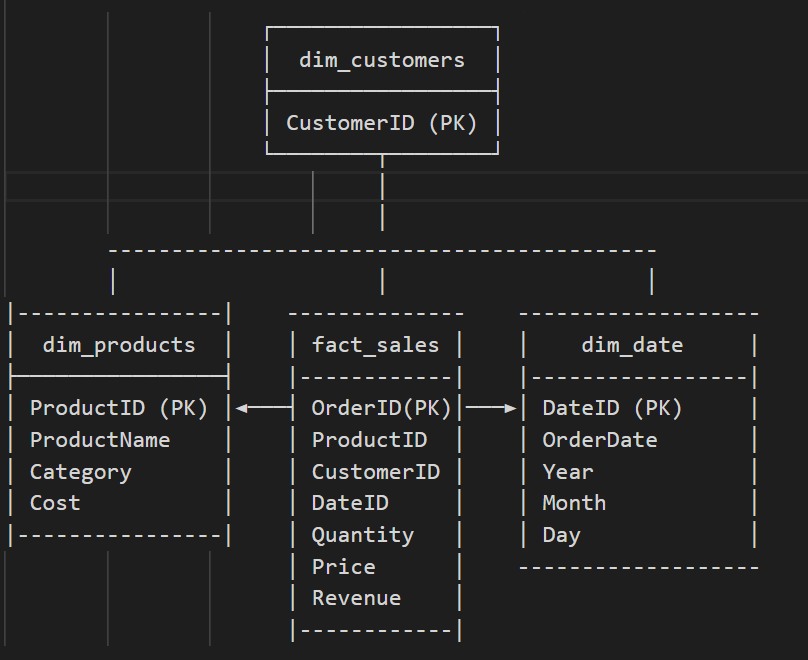

# govtech-2025-submission

## Setup Instructions
### Prerequisites
- Python 3.8 or higher
- `pip` 

### Step 1: Clone or download the project
Using git:
git clone <repository-url>
cd sales-etl-pipeline

## Task 2: Data Modeling
### Star Schema Design
Overview: The data warehouse utilises a star schema design pattern, comprising of a central fact table, `fact_sales` that's surrounded by dimension tables (shown below).



### Table Definitions
1. `fact_sales` (Fact Table)
The central fact table that contains measurable business events and metrics 

| Column     | Type    | Description                             | Key Type     |
|------------|---------|-----------------------------------------|--------------|
| OrderID    | INTEGER | Unique order identifier                 | PRIMARY KEY  |
| ProductID  | TEXT    | Reference to product dimension          | FOREIGN KEY  |
| CustomerID | TEXT    | Reference to customer dimension         | FOREIGN KEY  |
| DateID     | INTEGER | Reference to date dimension             | FOREIGN KEY  |
| Quantity   | INTEGER | Number of units sold                    | MEASURE      |
| Price      | REAL    | Unit price at time of sale              | MEASURE      |
| Revenue    | REAL    | Total revenue (Quantity × Price)        | MEASURE      |


2. `dim_products` (Dimension Table)
Contains product master data and attributes

| Column      | Type  | Description                      | Key Type     |
|-------------|-------|----------------------------------|--------------|
| ProductID   | TEXT  | Unique product identifier        | PRIMARY KEY  |
| ProductName | TEXT  | Descriptive product name         | ATTRIBUTE    |
| Category    | TEXT  | Product category for grouping    | ATTRIBUTE    |
| Cost        | REAL  | Unit cost (for profit calc)      | ATTRIBUTE    |


3. `dim_date` (Dimension Table)
Date dimension table that can be used for time based analysis

| Column    | Type    | Description               | Key Type    |
|-----------|---------|---------------------------|-------------|
| DateID    | INTEGER | Surrogate key for date    | PRIMARY KEY |
| OrderDate | TEXT    | Actual date (YYYY-MM-DD)  | ATTRIBUTE   |
| Year      | INTEGER | Year component            | ATTRIBUTE   |
| Month     | INTEGER | Month component (1-12)    | ATTRIBUTE   |
| Day       | INTEGER | Day component (1-31)      | ATTRIBUTE   |


4. `dim_customers` (Dimension Table)
Customer dimension table for customer segmentation

| Column     | Type | Description                 | Key Type     |
|------------|------|-----------------------------|--------------|
| CustomerID | TEXT | Unique customer identifier  | PRIMARY KEY  |

### Relationships
- `fact_sales.ProductID -> dim_products.ProductID` (Many-to-One)  
- `fact_sales.CustomerID -> dim_customers.CustomerID` (Many-to-One)  
- `fact_sales.DateID -> dim_date.DateID` (Many-to-One)  

## Task 3: Analytical Query (SQL)
```sql
SELECT 
    d.Year,
    d.Month,
    CASE d.Month
        WHEN 1 THEN 'January'
        WHEN 2 THEN 'February'
        WHEN 3 THEN 'March'
        WHEN 4 THEN 'April'
        WHEN 5 THEN 'May'
        WHEN 6 THEN 'June'
        WHEN 7 THEN 'July'
        WHEN 8 THEN 'August'
        WHEN 9 THEN 'September'
        WHEN 10 THEN 'October'
        WHEN 11 THEN 'November'
        WHEN 12 THEN 'December'
    END AS MonthName,
    p.Category,
    COUNT(DISTINCT f.OrderID) AS OrderCount,
    SUM(f.Quantity) AS TotalUnitsSold,
    ROUND(SUM(f.Revenue), 2) AS TotalRevenue,
    ROUND(AVG(f.Revenue), 2) AS AverageOrderRevenue
FROM fact_sales f
INNER JOIN dim_products p ON f.ProductID = p.ProductID
INNER JOIN dim_date d ON f.DateID = d.DateID
GROUP BY d.Year, d.Month, p.Category
ORDER BY d.Year, d.Month, TotalRevenue DESC;
```

## Task 4: Dashboarding Use Case
